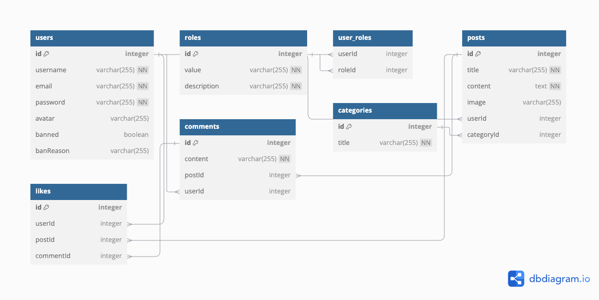

# **usof**

**usof** is a backend application inspired by platforms like StackOverflow and Reddit. It provides an API for user authentication, posting, commenting, and likes. The project demonstrates modern backend development practices using **NestJS** and **Sequelize**.

---

## 📋 Table of Contents

- [⚡️ Getting Started](#getting-started)
- [📄 API Documentation](#api-documentation)
- [📝 Database Schema](#database-schema)
- [🧾 License](#license)

---

## <a name="getting-started">⚡️ Getting Started</a>

### <a name="prerequisites">📋 Prerequisites</a>

Ensure you have the following installed:
- [Node.js](https://nodejs.org/en) (v16 or higher)
- [npm](https://www.npmjs.com) (v7 or higher)
- [PostgreSQL](https://www.postgresql.org) (v12 or higher)

### <a name="installation">⚙️ Installation</a>

1. Clone the repository:
   
    ```bash
    git clone https://github.com/t1tandr/usof-backend
    ```

2. Navigate to the project directory:
    
    ```bash
    cd usof-backend
    ```

3. Install dependencies:
    
    ```bash
    npm install
    ```

4. Create a `.env` file based on `.env.example` and configure the environment variables.

### <a name="executing-program">🚀 Executing program</a>
To run the application, use the following command:

    ```bash
    npm run start:dev


## <a name="api-documentation">📄 API Documentation</a>

The application uses Swagger for API documentation.\
Visit `http://localhost:3000/api/docs` in your browser after starting the server to view the interactive API documentation.

## <a name="database-schema">📝 Database Schema</a>

The database schema is managed using Prisma. Below is a visual repesentation of the schema:

<p align="center">
  
</p>

## <a name="license">🧾 License</a>

This project is licensed under the [MIT License](http://opensource.org/licenses/MIT).


